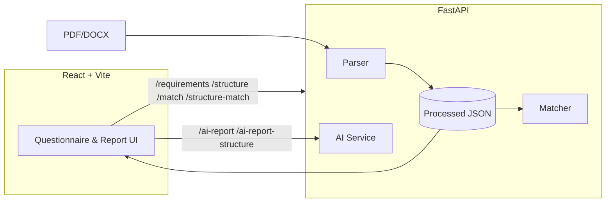

# Licensing Assistant — FastAPI + React 19

An end-to-end system that parses restaurant licensing requirements (Hebrew source), structures them to JSON, matches them to a business profile, and generates an AI-assisted, business-friendly report in Hebrew.

## Project goals
- Parse PDF/DOCX source into structured data
- Ask a short questionnaire and match only relevant requirements
- Produce a clear AI report: categories, priorities, and actionable steps

## Tech stack and versions
- Backend: FastAPI (Python)
  - Dependencies: see `backend/requirements.txt`
  - Notable versions: fastapi 0.115.2, uvicorn 0.30.6, pydantic 2.9.2, python-docx 1.1.2, pdfplumber 0.11.4, python-dotenv 1.0.1, python-bidi 0.4.2, openai ≥ 1.40.0
- Frontend: React 19 + Vite
- AI: OpenAI API (if `OPENAI_API_KEY` provided)

## Quick start (Windows PowerShell)

Backend:
```powershell
python -m venv .venv
. .venv\Scripts\Activate.ps1
pip install -r backend/requirements.txt
uvicorn backend.app:app --reload --host 127.0.0.1 --port 8000
```

Frontend (new terminal):
```powershell
cd frontend
npm i
npm run dev
```

- API docs: `http://127.0.0.1:8000/docs`
- UI: `http://127.0.0.1:5173`

## Configuration
- Backend: `.env` with `OPENAI_API_KEY` to enable OpenAI reports.
- Frontend: optional `VITE_API_URL` (default `http://127.0.0.1:8000`).

## Architecture


## Data processing (TXT → JSON)
- Place `18-07-2022_4.2A.txt` at project root.
- Build flat list: call `POST /parse-text` (also available via Swagger UI).
  - Output: `backend/data/processed/requirements.json`
- Build hierarchical structure: call `POST /parse-structure` (TXT-only).
  - Output: `backend/data/processed/structure.json`

## Data schema (simplified)

BusinessInput
```json
{
  "area_sqm": 80,
  "seats": 40,
  "uses_gas": false,
  "serves_meat": true,
  "offers_delivery": true
}
```

Requirement
```json
{
  "id": "4.2.1",
  "title": "כיבוי אש",
  "description": "דרישות כיבוי אש למטבח …",
  "min_area_sqm": 50,
  "max_area_sqm": 200,
  "min_seats": 20,
  "max_seats": 80,
  "requires_gas": true,
  "serves_meat": null,
  "offers_delivery": null,
  "category": "בטיחות"
}
```

SectionNode (hierarchical)
```json
{
  "id": "2.7.1.5.8",
  "level": 3,
  "title": "כותרת קצרה",
  "text": "טקסט סעיף מלא",
  "context": "normal",
  "group_level": null,
  "min_area_sqm": null,
  "max_area_sqm": null,
  "min_seats": null,
  "max_seats": null,
  "requires_gas": null,
  "serves_meat": null,
  "offers_delivery": null,
  "children": []
}
```

## Matching algorithm (overview)
- Flat requirements: an item matches if all present constraints pass:
  - Area/Seats: within min/max (inclusive) when provided
  - Booleans (gas/meat/delivery): equal when provided
- Structure matching: filters `SectionNode`s using business-aware heuristics (keywords + numeric hints), then AI gets the matched nodes INCLUDING all descendants (depth-first) for context.

## API documentation

Health
```
GET /health → { "status": "ok" }
```

Parse flat requirements
```
POST /parse-text
Query: txt_path? (optional)
Response: { total_requirements: number, sample: Requirement[] }
```

Parse hierarchical structure
```
POST /parse-structure
Query: txt_path? (optional)
Response: { nodes: SectionNode[], count: number }
```

Get flat requirements
```
GET /requirements → Requirement[]
```

Match flat requirements
```
POST /match
Body: BusinessInput
Response: { total_requirements, matched_count, matched: Requirement[] }
```

Get structure
```
GET /structure → { nodes: SectionNode[], count: number }
```

Match structure
```
POST /structure-match
Body: BusinessInput
Response: { nodes: SectionNode[], count: number }
```

AI report from flat requirements
```
POST /ai-report
Body: { business: BusinessInput, matched: Requirement[], language?: "he"|"en" }
Response: { report: string }
```

AI report from structure nodes (recommended)
```
POST /ai-report-structure
Body: { business: BusinessInput, nodes: SectionNode[], language?: "he"|"en" }
Response: { report: string }
```

## AI usage and prompts
- Tools used: Cursor AI for development; OpenAI API for reporting.
- Model: `gpt-4o-mini` (balanced cost/quality/latency), temperature `0.3` for consistent structure.
- System message (Hebrew, abridged): “אתה יועץ רישוי עסקים… דוח מקצועי בעברית… קטגוריות, עדיפויות והמלצות פעולה… הימנע משפה משפטית”.
- User prompt includes:
  1) Business profile (area, seats, gas/meat/delivery)
  2) Guidelines (שפה ברורה, ארגון לקטגוריות, עדיפויות, המלצות פעולה)
  3) Required format (סיכום מנהלים, לפי קטגוריות, תוכנית פעולה, סיכונים, מידע חסר)
  4) Matched items (for structure: all descendants flattened with indentation)

Example (structure mode, truncated):
```text
פרטי העסק: שטח 80 מ"ר, 40 מקומות ישיבה, שימוש בגז: false, מגיש בשר: true, משלוחים: true.

הנחיות הפקה:
- כתיבה בעברית ברורה…
…

סעיפים למימוש/ניתוח:
- [2.7] כותרת: טקסט…
  - [2.7.1] …
    - [2.7.1.5.8] …
```

## Screenshots (suggested)
- Questionnaire view
- Matched requirements (tree)
- AI report view

## 4. למידה ושיפורים

### יומן פיתוח
במהלך העבודה נתקלתי בכמה אתגרים מעניינים:

- מציאת הדרישות הנכונות מתוך המסמך: לא כל סעיף רלוונטי לכל עסק. בניתי מנוע התאמה שמבוסס גם על מסננים כמותיים (שטח/מקומות) וגם על מאפיינים בוליאניים (גז/בשר/משלוחים). בנוסף, הוספתי התאמה מבוססת מילות מפתח כדי לא לפספס סעיפים חשובים שנוסחו באופן שונה.
- פרסינג של טקסט בעברית: עברית היא שפה מימין לשמאל ומערבת גרשיים/מירכאות ומספור מעורב. נדרש נרמול רווחים, טיפול ב‑RTL, ושמירה על אותיות מיוחדות כדי למנוע טעויות בזיהוי תבניות.
- סדר היררכי כשיש כמה שיטות מספור במקביל: בקובץ הופיעו גם פרקים/סעיפים (1, 1.2, 1.2.3) וגם נספחים/קבוצות. הוספתי הקשר (context/group_level) ושיפרתי את המיפוי לעץ כך שהמספור יישמר ויהיה ניתן לשחזר את הסדר הנכון. לבסוף, ביצעתי פריסה עומק‑קודם (DFS) כדי לכלול אוטומטית גם תתי‑סעיפים בדוח ה‑AI.

מהעבודה הזו למדתי שכדאי להעדיף כללים פשוטים וברורים להתאמה, ואז לתת ל‑AI לזקק את התוצאה לשפה עסקית. כשה‑AI מקבל קלט מסודר וברור (כולל כל הצאצאים הרלוונטיים), האיכות של הדוח קופצת משמעותית.

### שיפורים עתידיים
- ייצוא דוח ל‑PDF/HTML וכפתור "העתק" מהיר
- תצוגת "למה זה הותאם" לכל סעיף (הסבר קצר)
- אפשרות להוסיף סעיף "כללי לכל עסק" (מכובה כברירת מחדל)
- אפשרות בחירת מודל/שפה וזרע לדטרמיניזם
- Docker Compose להרצה בלחיצה אחת

### לקחים
- הגדרת פרומפטים ברורה ומבנית (Guidelines + Template) מביאה פער איכות מורגש.
- אין תחליף לדאטה נקי: פרסינג טוב והיררכיה נאמנה למקור משפיעים ישירות על איכות ה‑AI.
- הפרדה בין התאמה דטרמיניסטית (מנוע כללים) ליצירת ניסוח (LLM) מייצרת שקיפות ויציבות טובות יותר.

## License
MIT
